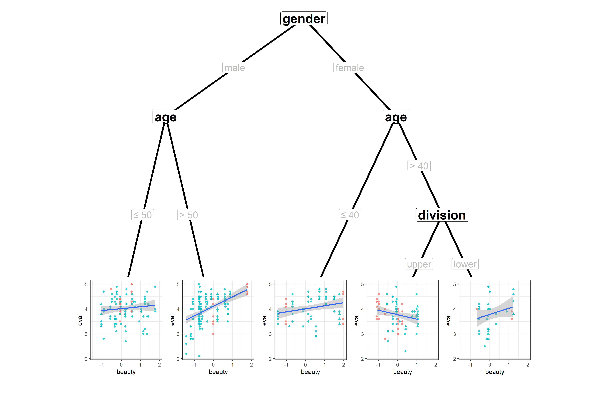

ggparty
================


ggplot2 visualizations for the partykit package.

``` r
data("TeachingRatings", package = "AER")
tr <- subset(TeachingRatings, credits == "more")

tr_tree <- lmtree(eval ~ beauty | minority + age + gender + division + native +
                     tenure, data = tr, weights = students, caseweights = FALSE)

ggparty(tr_tree) +
  geom_edge(size = 1.5) +
  geom_node_inner(fontface = "bold", size = 8) +
  geom_edge_label_discrete(colour = "grey", size = 6) +
  geom_edge_label_continuous(colour = "grey", size = 6) +
  geom_nodeplot(gglist = list(geom_point(aes(x = beauty,
                                             y = eval,
                                             col = tenure,
                                             shape = minority),
                                         alpha = 0.8),
                              geom_smooth(aes(x = beauty, y = eval),
                                          method = "lm"),
                              theme_bw()),
                id = "terminal",
                width = 0.15,
                height = 0.25,
                ynudge = - 0.05) + 
  ylim(-0.25, 1)
```




[](https://travis-ci.org/mmostly-harmless/ggparty)
